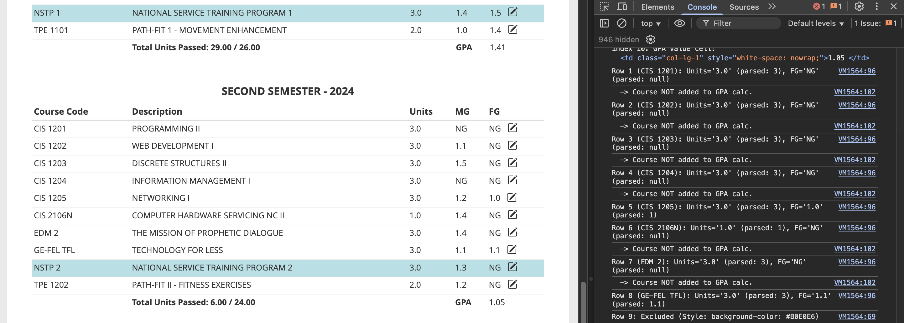

# ISMIS Theoretical Grade Calculator

A client-side script that modifies the individual grade cell values to add an edit button. Features dynamic calculation of GPA and GWA based on inputted cell values.

## NOTE
- This is a client side script only and **WILL NOT** edit your grades in the ISMIS/USC database. 
- Grades highlighted in blue (NSTP) are not included in GPA/GWA calculation. Although they might be included in the GWA calculation since total units earned include NSTP (per observation), I'm not very sure of it since manual calculations showed a different GWA w/ NSTP. Your actual GWA might differ.
- Idk if this is legal 



## Usage
#### Method 1 (manual)
1. Copy the entire code from ``src/grade-calculator.js``.
2. Open Dev Tools when you are in the View Grades page and open the Console tab.
3. Paste the code. It should run automatically.

#### Method 2 (semi-manual)
1. Open Dev tools when you are in the View Grades page and open the console tab.
2. Paste this code. It should run automatically. 
	```js
	(function() {
	    const script = document.createElement('script');
	    script.src = 'https://tutorial.dcism.org/code/grade-calculator.js';
	    script.async = true;
	    document.head.appendChild(script);
	})();
	```

## Notice
- This tool may or may not be illegal as it is a modification of ISMIS. However, this script in nature is only client-sided and does not provide any benefits, advantages or actual modifications to your real data.
- The script presents itself as a Quality of Life (QoL) feature, similar to Canvas LMS' "what-if" test scores. It does not communicate with any servers or impose a real security threat.
- The Student Manual (2023 Edition) does not mention anything regarding 'ISMIS', 'modification', 'client' other than **Article 3, Section 6 under Offenses > B. Offenses against security, safety and order**, which states:
 `unauthorized access of computer files like hacking
and other IT-related violations`
- ISMIS in general does not have clear '**Terms of Use/Service**' nor does USC have a clear **Acceptable Use Policy** (AUP) other than the ones listed in the Student Manual.
- If you're someone of authority who wants this script to be taken down, please **let me know.**
